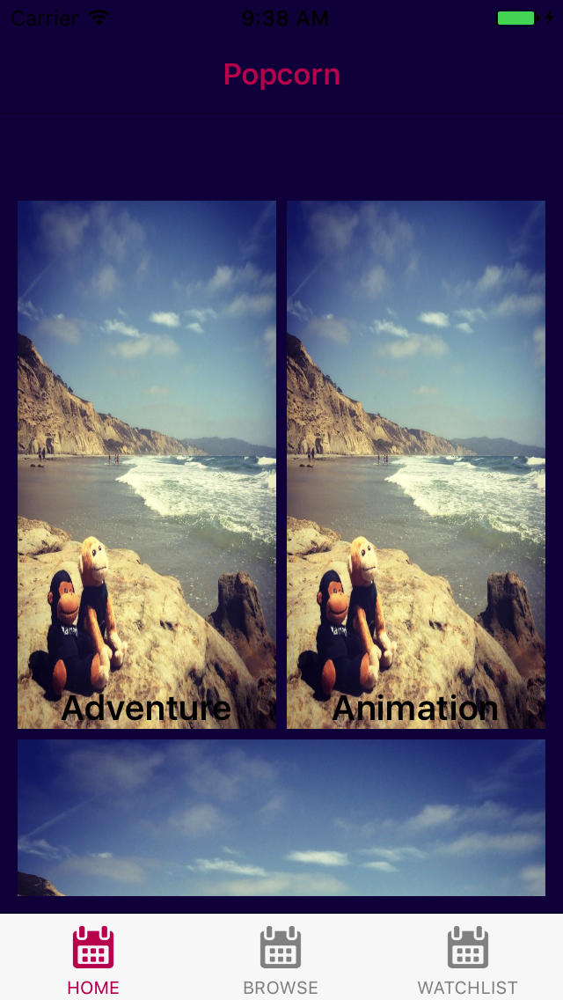
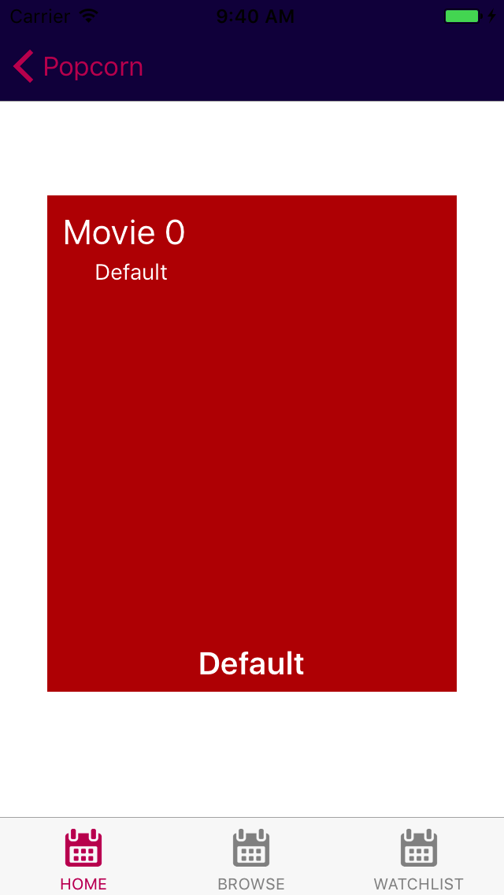
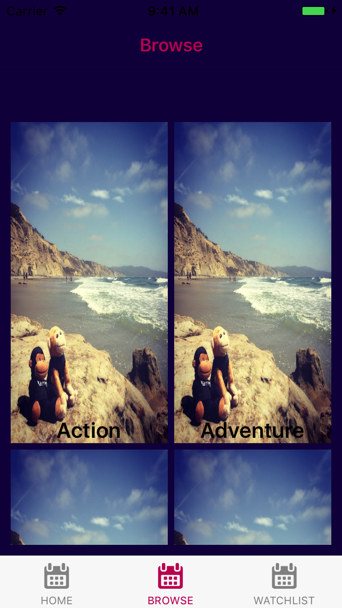
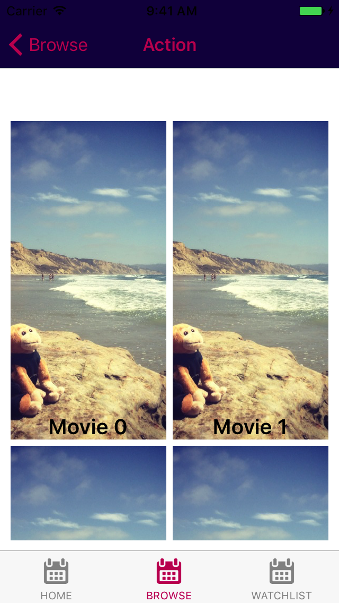
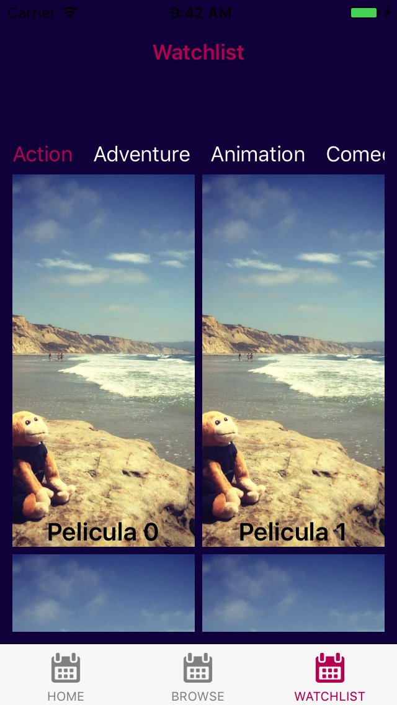
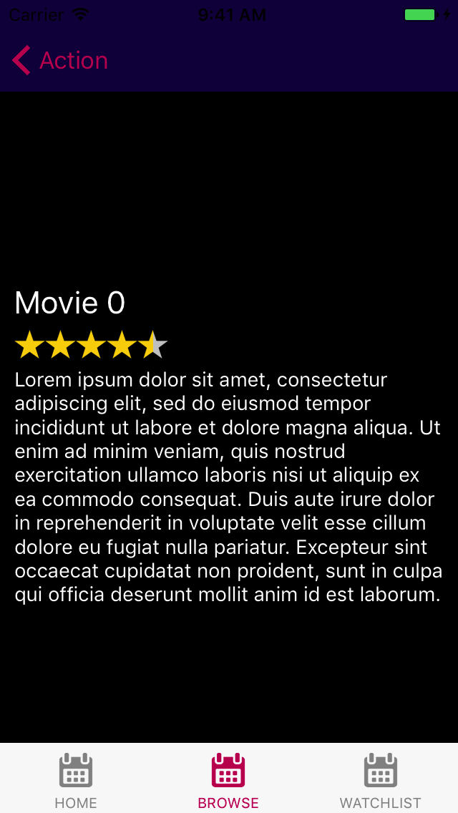

# Workflow #

## HomePage

Any element in the HomePage takes you to [SwipePage](#swipepage)

## SwipePage

At this page you can swipe the movie right to add it to the watchlist, or to the left to pass it.

If you added a movie to the watchlist, you should see it [there](#watchlistpage).

## BrowsePage

If you click any element in the BrowsePage it takes you to [CategoryPage](#categorypage)

## CategoryPage

Any element in the CategoryPage takes you to [MoviePage](#moviepage)

## WatchlistPage

Any element in the WatchlistPage takes you to [MoviePage](#moviepage)

## MoviePage

